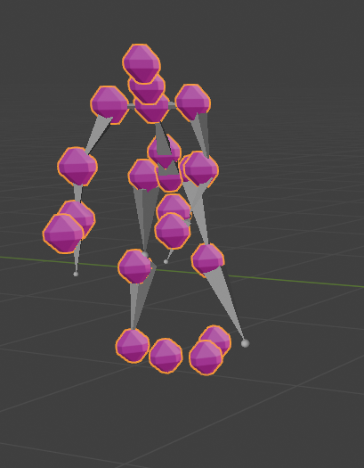
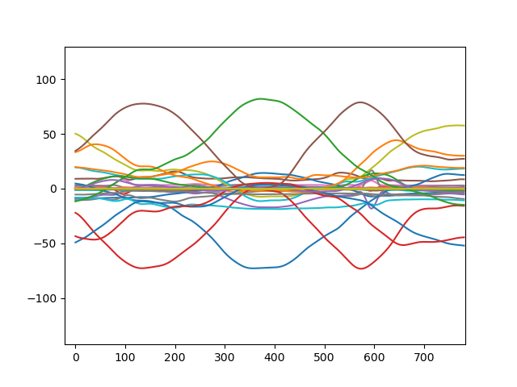
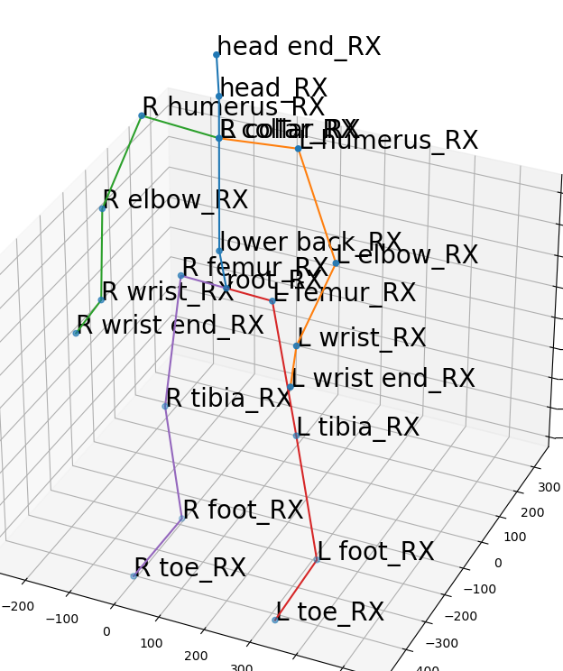

# Blender_CSV_Visualizer.py
To compare the output BHV with the input CSV, this blender script lets you visualize a LARA CSV in Blender.
It displays the raw points of the human for a given frame. 
The image below shows the positions from the CSV in pink and the skeleton from the bhv in gray. 
Note that running only the script will show the CSV positions with single points instead of colored balls.  

To use it: open Blender, go to the tab "Scripting", click the "Open Text" button (folder-icon) and open the script. Then press the "Run Script" button (play-icon).
Now go back to the Layout Tab and change the framenumber in the animation panel.

# create_Lara_csv.py
This file can create a simple human motion csv in the Lara file format by moving joints linearly.

# plot_bvh.py
Plot the joint movements as one line diagramm for each joint. Helpful to analyse whether the generated bvh is correct.  

# visualize_joints_Lara.py
This script lets you visualize the human skeleton of a csv file, as shown below.
Note that the current form of this script only works with LARa-v1, not with newer versions.
